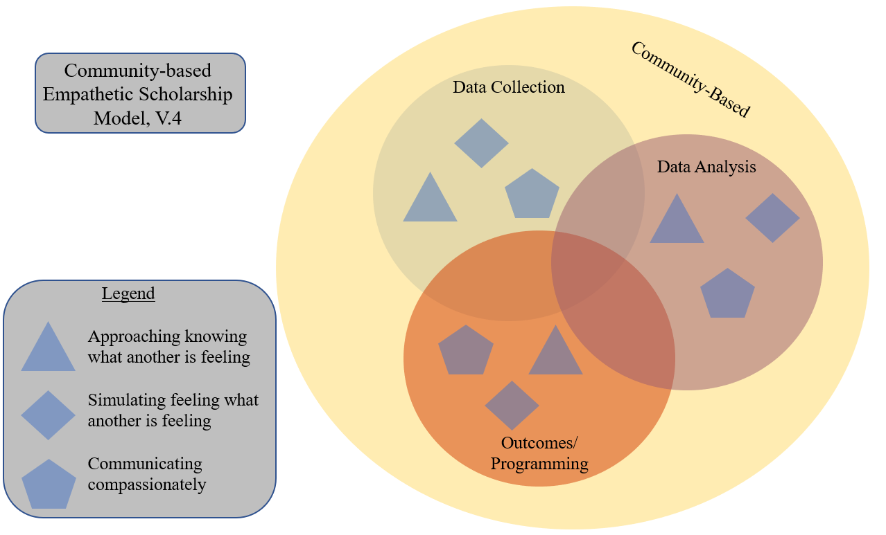

## Modeling Empathy

This is where my endeavors to model empathy as a metatheoretical approach to conducting research by humans with humans will live. I intend to update this page as I get input from conferences and emails from scholars with their suggestions. 

### The Model

Great work in Communication Studies and the social sciences, more broadly, have used engaged methodologies like the relationally attentive approach (RAA; see Connaughton, Linabary, Krishna, Kuang, Anaele, Vibber, Yakova & Jones, 2017; Linabary, Krishna & Connaughton, 2017), participatory action research (PAR; see Gubrium & Harper, 2016; Gubrium, Harper & Otañez; 2016), and community-based participatory research (CBPR). While all of these methodologies are engaged, they each hold a different central part as a core tenet. RAA, for example, centers “with” and “relational” orientations. RAA also encourages “attentiveness” to relationship with whom we are collaborating and argues that the communicative choices we make (i.e., convening inclusively, deferring, supporting, validating) must be conscious choices if we are relationally attentive. With PAR, there is a centralized focus around the research producing “action”. What is missing is the power dynamic of things being defined relative to one another; the trouble comes when one thing is viewed as the dominant/majority over the other and the other is only defined relative to the dominant. I advance that centralizing the act of empathy in engaged scholarship is how best to subvert the assumed power dichotomy within research. This is how empathy came to be the core tenant of the proposed Community-based Empathetic Scholarship model. The model was created via a literature review of scholarship on empathy, RAA, and PAR which was followed with four phases of model iterative (de)construction performed from the vantage points of Critical Scholarship, Intersectional feminism, Black feminism, Chicana feminism, (dis)ability allyship and anti-colonialism. From this, I propose three dimensions of empathy as situated within three major processes of applied research and colored by the community-based practices of RAA, PAR, and CBPR. The dimensions of empathy are approaching knowing what another is feeling, simulating feeling what another is feeling, and communicating compassionately which are a modification of the dimensions of empathy proposed by Levenson and Ruef (1992). In the Community-based Empathetic Scholar model, each of these dimensions are discussed in terms of how they present within the overlapping—and, often, simultaneous—applied research processes of data collection, data analysis, and outcomes/action. Empathy in data collection could look like, but not be limited to, inviting difficult discourse, being mindful of the accessibility of the data to the community, and premeditating the afterlife of the relationship being forged while gathering the data. For data analysis, this model encourages scholars to simulate the experience of having this data existing about themselves and treating it with the same reverence that they would hold in their own efforts to save-face. Then, in considering the outcomes and/or programming, this model emphasizes negotiating the power designed into the research relationship in favor of the community by collaboratively working toward something co-constructed. Following the in-depth discussion of envisioned usages, this project implores scholars to heed one call to action: practice empathy.

__Text description of the image of the model__ 

Pictured is a diagram of the Community-based Empathetic Scholarship Model (version 4). There are layers of shapes and colors. The most prominent being a large light yellow circle which reads "Community-based". Contained within the large light yellow circle are three overlapping circles which read (clockwise) "Data Collection" as a light green circle, "Data Analysis" as a light purple circle, and "Outcomes/Programming" as a light orange circle. Contained within each of the overlapping circles are a light blue triangle, a light blue diamond, and a light blue pentagon. These represent the three dimensions of empathy as being within the three areas of applied research which are contained within community-based pedagogy. The triangle represents "approaching knowing what another is feeling". The diamond represents "simulating feeling what another is feeling". The pentagon represents "communicating compassionately"

__Check out my video on [building a model](https://www.youtube.com/watch?v=rodHVoKKnOE) for an oral presentation of my work from OCMC 2021.__ 

__How the model was designed__ 

Early versions of this model were designed with consideration for my scientific model colleagues in mind. I wanted this to be a “plug-n-play” model that was fluid and informed by critical scholarship. This lead to an issue where the first model was not as flexibile as it needed to be based on the empathy literature and had the potential to have a colonizing and paternalistic afterlife. With this, I borrowed from the rhetoricians and critically examined the language as well as scholars of visual communication to look at the overall presentation of the model. This produced a model with clearer language and political influence, but it was messy and hard to use. Ultimately, I knew I was working toward making a model to describe a non-linear process with components that could both be repeated as well as done simultaneously to one another. 

For further assistance, I turned to my colleague in Mathematics, Alden Bradford, for assistance. With his background in computer programming, I knew he would be an excellent resource for helping me reimagine how to express this process visually. He had two thoughts on what he’d do if he were trying to make a graphical model of something like that. His first thought was that he’d look at the conventions that computer program flowchart creators use when they make models to map out what a program should(n’t) be able to do before it gets programmed. He was thinking that they might have some clever organizational and symbolic conventions that might help him communicate the idea to a broader audience as well as help make a tidy graphical design. His second thought was that if he were to do it with only the knowledge he currently possessed that he would organize the research phases horizontally with differently shaped boxes within each phase to graphically represent the empathetic dimensions. When I probed him about whether or not he would be concerned with folks looking at his model and assuming some type of linearity to it, he replied that he viewed the model as a part of the whole paper and would rely on the write-up of the paper that the model is contained within to dispel that assumption for his audience. This got me thinking more about symbology and art. 

Rather than using the common symbology of written words, I started thinking of how I could use simple geometric shapes to represent both ideas and the relationships between those ideas to tell a story. This is not unlike painting and, as a painter myself, I knew that a medium like watercolor would be most appropriate for illustrating the relationship that I wanted to describe because the transparency and dilutability of the medium allows parts of the whole image to be layered as well as bleed into one another to communicate the interdependence and non-linear relationship that the components of the Community-based Empathetic Scholarship Model are comprised of. With these ideas stewing about, I was reminded that for this model to be as accessible as possible that I would need to do research about the different colorblind color pallets that are recommended. After spending some time looking through the pallets recommended across the three major types of colorblindness, I noticed that a large component of making the color design of the model accessible would be for the colors to be not only different in which ones I chose, but also different in their values so that there would be enough of a cue to see the components of the model as different from one another.  

### Goals for The Model 
1. Evolve the concept of empathy to model over the general processes of other research programs 
2. Edited volume book with different takes on emapthy that help complicate and build the model

### Running list of Comments
__Comment 1__

I'm curious to learn more about the proposed power dynamic that emerges from relativistic comparisons. I'm wondering if the claim here is that scholars tend to use a binary reference (e.g. better/worse)? If so, perhaps the presentation will draw this out more clearly.  I really like the notion challenging the A vs. -A typology. What does "empathy" do to solve this conundrum? Does it encourage scholars to reject referential ordering? Or, does it encourage more complex/dynamic referential judgements? What are the potential downsides to avoiding/rejecting referential assessments in engaged research? (I think of scholarship in sociology about how important comparisons are for making sense of and interacting within a social world - e.g Star & Bowker, 1999).

__Comment 2__

How are you defining empathy in this project? Is it a communicative construct? How does it differ from how our colleagues in psychology and other disciplines define empathy? I really love the power consideration here - how might that dynamic play out during the practice of engaged scholarship? Beyond engaged scholarship, how might you extend your call to action (to practice empathy) to other contexts? Given the moment we are living in, your call for action seems to be more important than ever.

__Comment 3__

You had excellent thoughts about empathy and power in your prelim response which I believe you will further develop. I am also curious to hear more about how you will conceptualize empathy in quantitative research approaches.

### Defining Empathy Through Comparison
  When it comes to empathy, I think Zahavi (2014) sums up attempting to pin down a definition for this concept succinctly, “one reason why it continues to be so difficult to reach a commonly accepted definition of empathy is because people have been using the notion to designate quite different phenomena” (152). Despite the multitude of existing conceptualizations that have been put forth about empathy, what I find most difficult about forming my own thoughts on the topic is the muddiness that occurs when considering the many interchangeable terms that are colloquially used in place of empathy. In this paper, I will explore differences between empathy and, associated terms like, sympathy, compassion, humility, and love. After weeding through the, oft, muddied differences, I will propose a conceptualization of empathy that I intend to use in my own work and state a claim in favor of the study of empathy in Communication Studies. 

  As discussed, by Zahavi (2014), a traditional conceptualization of empathy is that it is a type of simulation where the empathizer comes to understand the other through attempting to understand themselves in a fictionalized simulation wherein the empathizer places themselves within the circumstances of the other and considers how they might feel and respond.  However, an important note about empathy as a simulated process, as conceptualized by Edith Stein, is that the empathetic experiencing of another’s emotions is not the same as experiencing that emotion for oneself (as cited by Bianchi, 1999, 286). In application, this means that if I were to empathetically experience the pain of another who is sharing their trauma with me that this is not the same as me experiencing the pain of a trauma. My own experiences that enable me to respond with empathy are my own, but their experiences are not mine. This becomes particularly important when reconsidering a concept from Husserl’s (1913; as cited by Bianchi, 1999) semester notes where he claims that knowledge of the other is known relative to other things. While there has been some further development in the conceptualization and usage of the term empathy, it is crucial to recognize that the notion of simulation does not go away. For instance, Sinclair, et al (2017), conducted a series of interviews with medical patients with the goal of determining if and what differences existed between empathy, compassion, and sympathy; they found that “empathy was [viewed as] an affective response that acknowledges and attempts to understand an individual’s suffering through emotional resonance” (443). Within their article, Sinclair, et al (2017), share that they did not find empathy was regarded as an act that was motivated toward an active response nor assistance for the patient. Contrasting this, Birdi, Wilson & Cocker (2008) cite Levenson and Ruef (1992) as offering “three separate dimensions to empathy, including knowing what another person is feeling; feeling what another is feeling; responding compassionately to another person’s distress. An individual therefore is capable of experiencing each of these empathic dimensions in differing circumstances” (585). In this conceptualization, it seems that a necessary component of empathy is a response which I interpret to be as a form of action within the wishes of the person being empathized with (e.g. a patient, community member, student, etc.). Broadening the horizon from looking at what empathy can be to how empathy has been used, Kunyk & Olson (2001) found 5 conceptualizations of empathy through their concept analysis of “nursing articles describing the concept of empathy, or articles that used empathy as a variable in a research project, from 1992 to the end of 2000” (318). The conceptualizations they found were: “empathy as a human trait” (318-321); “empathy as a professional state” (321-322); “empathy as a communication process” (322); “empathy as caring” (322-323); and “empathy as a special relationship” (323). What seems to be common among all concepts found in this literature is that empathy is a form of labor and can be part of how someone identifies. From this—and the colloquial usage of terms like “I am a kind person”—I assert that empathy is an active identification in which one views themselves as both valuing and having the capacity to engage in simulating feeling and experience as a means to connect with others and mobilize in their relationships.  
  
  What I find missing from the discourse around empathy is a discussion of the power dynamics of feelings/experiences being defined relative to one another; the trouble comes when one feeling/experience is viewed as the dominant/majority over another and the other is only defined relative to the dominant. This, I believe, is where some struggle with the difference between empathy and sympathy. I believe that an empathy which only superficially recognizes the power differential between subjects is sympathy. In this understanding, sympathy is closer to pity than it is to empathy. Supporting my assertion that sympathy is qualitatively less desirable than empathy, Sinclair, et al (2017) found that sympathy is “a pity-based response to a distressing situation that is characterized by a lack of relational understanding and the self-preservation of the observer” according to their interviews with patients (440). They noted that patients felt strongly against receiving sympathy from a care provider as it was felt to be worse than maintaining an emotional distance. Relating this back to my claim about the difference between empathy and sympathy—that empathy without recognition of power dynamics is sympathy—my claim is supported by the definition found in the study with sympathy being “characterized by a lack of relational understanding and the self-preservation of the observer” (440). A lack of relational understanding necessarily connects to there being a lack of recognition of power dynamics because it does not seem plausible that someone could simultaneously lack an understanding of their relationship to another, but be capable of understanding the power differential in that relationship; or, put another way, to understand power is to have an understanding of the relative positions of those involved in the relationship. 
  
  While there is a complicated colloquial understanding that some difference between empathy and sympathy should exist—even if that distinction tends to go unspoken—this is not as much the case when contemplating a difference between compassion and empathy as the two terms are oft used interchangeably. When considering the etymology and usage of compassion it has been found that “the word compassion comes from the Latin compati, meaning to suffer with, most modern definitions of compassion recognize that it is rooted in caring motives that require a range of competencies for its enactment, including empathy, sympathy, generosity, openness, distress tolerance, commitment, courage, among others (Dalai Lama, 1995; Gilbert, 1989, 2005, 2009; Gilbert & Choden, 2013; Goetz, Keltner, & Simon-Thomas, 2010; as cited by Gilbert, 2015, 240). In this conceptualization of compassion, empathy and sympathy are means by which to practice compassion. In contrast, according to Sinclair, et al (2017), “the definition of compassion that emerged from the data was a virtuous response that seeks to address the suffering and needs of a person through relational understanding and action” (444). This latter definition treats compassion as more distinct from empathy and sympathy and, in their study, they found that patients considered compassion to be better than sympathy. Drawing this wide fissure between compassion and sympathy a little narrower, Jeffrey (2016) stated that, “compassion, like sympathy, is evoked when something bad happens to another person, but compassion is generated by more serious states. It implies a desire to help but does not necessarily result in a helping action” (Jeffrey, 2016, 448). In considering this conceptualization of compassion relative to sympathy, I can see where both Gilbert (2015) and the findings of Sinclair, et al (2017) share a more common tie as both recognize compassion as hierarchically above sympathy, but the latter introduces more nuance to the specific choice to mobilize care through sympathy and argues that compassion should not contain sympathy because it is not viewed, by patients, as “virtuous”, possessing “relational understanding”, and seeming devoid of “action” potential (444). Also of interest in the Sinclair, et al (2017), definition of compassion and further supporting material from Table 3 is that it positions compassion as being a “type of response” that is a “proactive and targeted response to a distressing situation” (442) and this was not viewed as true of empathy. This contrasts with discourse presented earlier in this paper by Levenson and Ruef (1992; as cited by Birdi, Wilson & Cocker, 2008) where it was stated that the third dimension of empathy is “responding compassionately to another person’s distress” (585). What appears to be happening here is that compassion is necessary to the mobilization potential of empathy and that because compassion is part of empathy that empathy is a responsive act and that response is in the form of compassion. 

  Similar to sympathy and compassion, humility is often used in place of empathy in everyday discourse. According to D’Errico (2020),
_humility can be defined as a positive feature that can be associated with intrapersonal benefits, like gratitude (Kruse, Chancellor, Ruberton, & Lyubomirsky, 2014) or self-control (Tong et al., 2016), and interpersonal ones, like fostering forgiveness (Davis et al., 2013), promoting prosocial behavior (Exline & Hill, 2012; LaBouff, Rowatt, Johnson, Tsang, & Willerton, 2012), and buffering against stress (Krause, Pargament, Hill, & Ironson, 2016). Someone with humility is also generally considered to tend to express “positive other-oriented emotions” (e.g., empathy, compassion, sympathy, love) and the ability to regulate self-oriented emotions in socially acceptable ways (Davis et al., 2013) (3008)._
Like the definition of compassion from Gilbert (2015), this definition of humility treats other related terms as lower aspects of the hierarchy concept of interest (i.e. humility). In this case, empathy, sympathy, and compassion are not so much means by which to achieve humility, but are actions a person who identifies with possessing humility would be likely to take. The identity causes the action. From the literature presented in this definition, it appears that humility as an act is tied to some notion of cost-benefit which was not prevalent in the literature reviewed about empathy, sympathy, and compassion. I do see potential for acting with humility to recognize power differentials an understanding relationships—unlike sympathy—but it does not seem apparent that humility is considered to involve some form of actionable response to the shared feelings and experience (e.g. empathy & compassion).  

  Finally, we come to conceptualizing love. According to bell hooks (2018), “when we see love as a combination of trust, commitment, care, respect, knowledge, and responsibility, we can work on developing these qualities or, if they are already a part of who we are, we can learn to extend them to ourselves” (86). Love may be the more stigmatized term to apply to research work among the terms discussed in this paper as it has romantic and sexual connotations which are viewed as inappropriate for valid & professional research. However, the definition provided complicates these false narratives of what it means to love another. I claim that love is an essential part of both compassionate and empathetic scholarship. Taking specifically empathy as an example, the dimensions of empathy presented earlier in this paper were to know what another is feeling, to feel what they are feeling, and to respond compassionately. Using hooks’ conceptualization of love as being an act which combines “trust, commitment, care, respect, knowledge, and responsibility” (86), I argue that in order to know another’s feelings requires, but it not limited to, trust and knowledge; to be able to take on feeling what another is feeling requires, but is not limited to, commitment and respect; and to respond compassionately requires—all that the previous two required and—the care and responsibility of acting in allyship with and/or on behalf of another.  In this conceptualization, love is mobilized by empathy. 
  
  Throughout this paper, I have spoken of these concepts from an American-English understanding of language which has its own connotations that are unique from how speakers of another language might conceptualize these terms. For example, “English compassion and Russian sostradanie [direct translation of compassion to Russian] differ in the severity of the person’s condition and in the complexity and the expression of the feeling. Sostradanie is an emotional reaction which occurs only in response to very severe conditions experienced by another person, whereas compassion is appropriate in less serious states. Therefore, the range of situations that cause sostradanie is narrower than the range that causes compassion. In this respect, compassion is closer in meaning to sympathy and socˇuvstvie [direct translation of sympathy to Russian] than to sostradanie” (Gladkova, 2010, 279). I have also explored these concepts through my, primarily, White-female academic with a history of family trauma lens and this does present bias. 
  
	With each of these commonly linked concepts discussed, differentiated and connected, it seems that the professionally responsible thing to do is to provide a conceptualization of empathy relative to performing research work.  I propose three dimensions of empathy as situated within three major processes of applied research and colored by the community-based practices of RAA, PAR, and CBPR (see Connaughton, et al, 2017; Connaughton & Ptacek, 2020; Gubrium & Harper, 2016; Gubrium, Harper & Otañez, 2016; Kuang, et al, 2019; Linabary, Krishna & Connaughton, 2017). The dimensions of empathy are approaching knowing what another is feeling, simulating feeling what another is feeling, and communicating compassionately which are a modification of the dimensions of empathy proposed by Levenson and Ruef (1992; as cited by Birdi, Wilson & Cocker, 2008, 585). As stated, the concepts of compassion and love are present within empathy while being distinct from the pity-based sympathy and cost-benefit laden humility. Combining this conceptualization with applied research has resulted in what I have come to call the Community-Based Empathetic Scholarship Model. In the model, each of these dimensions are discussed in terms of how they present within the overlapping—and, often, simultaneous—applied research processes of data collection, data analysis, and outcomes/action. Empathy in data collection could look like, but not be limited to, inviting difficult discourse, being mindful of the accessibility of the data to the community, and premeditating the afterlife of the relationship being forged while gathering the data. For data analysis, this model encourages scholars to simulate the experience of having this data existing about themselves and treating it with the same reverence that they would hold in their own efforts to save-face. Then, in considering the outcomes and/or programming, this model emphasizes negotiating the power designed into the research relationship in favor of the community by collaboratively working toward something co-constructed. 
  
	As mentioned, I modified the dimensions of empathy proposed by Levenson and Ruef (1992) and an important modification that was made was to change the third dimension from “responding compassionately” (as cited by Birdi, Wilson & Cocker, 2008, 585) to communicating compassionately. This framing of the third dimension aligns with
_The conceptualization of empathy as an exceptional form of communication breaks empathy into a process whereby the nurse perceives the client's emotions and situation, then expresses understanding, and finally the client perceives the understanding of the nurse. The outcome of this process is an accurate perception of the client, and the client feeling understood. This conceptualization of empathy does not imply a predetermined response or, for that matter, that the response be verbal. However, the communication is a disciplined professional response, requiring an empathic attitude, and the skills necessary to convey this to the client (Olson 1995; as cited by Knuyk & Olson, 2001, 322)._
The distinction between responding and communicating reflects a anti colonialist rhetoric in which the compassion is not something that is done by the scholar to a community; rather compassion is something that is negotiated and co-constructed through dialogue, policy, and action with all available stakeholders. This idea that the process of engaging in empathy and the potential outcomes of empathy being communicative situates empathy squarely as something that would be germane to Communication Studies as a phenomenon to observe, a practice to emulate, and a concept worth conceptualizing further. In this work, I have heeded the call of the latter two elements which I claim to be of importance for scholars of Communication to attend to in their research and theorizing.
  
__References__

Bianchi, I. A. (1999). Solipsism, Empathy, Otherness. In _Life—The Outburst of Life in the Human Sphere_ (pp. 277-293). Springer, Dordrecht.

Birdi, B., Wilson, K., & Cocker, J. (2008). The public library, exclusion and empathy: a literature review. _Library Review_.

Connaughton, S.L., Linabary, J.R., Krishna, A., Kuang, K., Anaele, A., Vibber, K.S., Yakova, L., & Jones, C. (2017). Explicating a relationally attentive approach to conducting engaged communication scholarship. _Journal of Applied Communication Research_, 45, 517–536. DOI:10.1080/00909882.2017.1382707

Connaughton, S. L., & Ptacek, J. (2020). Doing engaged scholarship: When theory on inclusion meets practice in the context of a peacebuilding initiative in West Africa. In M. Doerfel & J. L. Gibbs (Eds.). _Building inclusiveness in organizations, institutions, and communities: Communication theory perspectives_ (pp. 43-57). New York: Routledge. 

D'Errico, F. (2020). Humility-based persuasion: Individual differences in elicited emotions and politician evaluation. _International Journal of Communication_, 14, 20.

Gilbert, P. (2015). The evolution and social dynamics of compassion. _Social and personality psychology compass_, 9(6), 239-254.

Gladkova, A. (2010). Sympathy, compassion, and empathy in English and Russian: A linguistic and cultural analysis. _Culture & Psychology_, 16(2), 267-285.

Gubrium, A., & Harper, K. (2016). _Participatory visual and digital methods_ (Vol. 10). Routledge.

Gubrium, A., Harper, K., & Otañez, M. (Eds.). (2016). _Participatory visual and digital research in action_. Routledge.

Hooks, B. (2018). _All about love: New visions_. William Morrow.

Jeffrey, D. (2016). Empathy, sympathy and compassion in healthcare: Is there a problem? Is there a difference? Does it matter?. _Journal of the Royal Society of Medicine_, 109(12), 446-452.

Kuang, K., Connaughton, S. L., Anaele, A., Vibber, K. S., Krishna, A., & Linabary, J. (2019). Extending communication campaigns from health context to peacebuilding context: A locally driven communication campaign approach in a peacebuilding initiative in Liberia. _Health Communication_. DOI: 10.1080/10410236.2019.1602818

Kunyk, D., & Olson, J. K. (2001). Clarification of conceptualizations of empathy. Journal of _Advanced nursing_, 35(3), 317-325.

Linabary, J. R., Krishna, A., & Connaughton, S. L. (2017). The conflict family: Storytelling as an activity and a method for locally led, community based peacebuilding. _Conflict Resolution Quarterly_, 34, 431-453. DOI: 10.1002/crq.21189

Sinclair, S., Beamer, K., Hack, T. F., McClement, S., Raffin Bouchal, S., Chochinov, H. M., & Hagen, N. A. (2017). Sympathy, empathy, and compassion: A grounded theory study of palliative care patients’ understandings, experiences, and preferences. _Palliative medicine_, 31(5), 437-447.

Zahavi, D. (2014). _Self and other: Exploring subjectivity, empathy, and shame_. Oxford University Press, USA.

