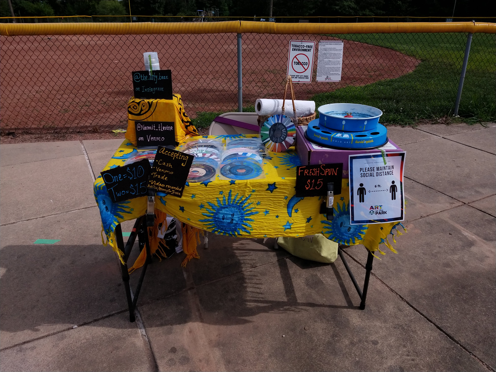
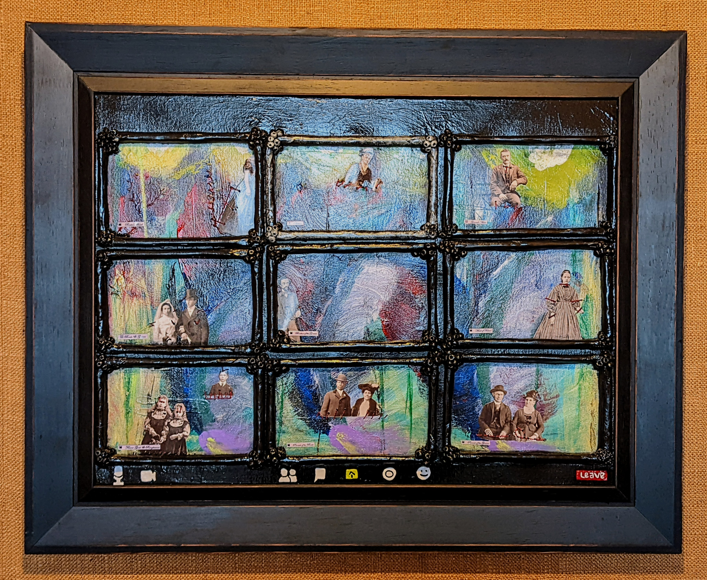
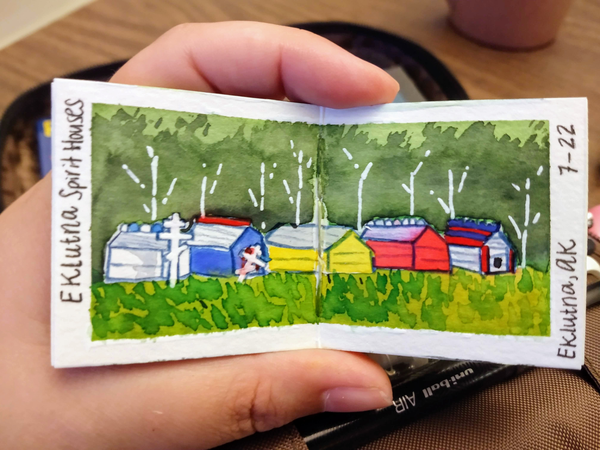

## Artwork by Naomi
I am a self-taught mixed media artist. I commonly work with recycled and repurposed materials as a means to improve my impact on the environment, save money, and transform materials that are commonly overlooked. I most commonly work with watercolor, gouache, acrylic paints, and acrylic inks. Some of my favorite art tools are fixed and modified vintage toys like the [Twirl-o-Paint](https://www.industrialartifacts.net/products/vintage-twirl-o-paint-childrens-painting-turntable?variant=13256531771435) and [The Big Press](https://media.hibid.com/img.axd?id=4392046215&wid=&p=&ext=&w=0&h=0&t=&lp=&c=True&wt=False&sz=Max&rt=0&checksum=ZyLkULNan0e4jF917H84vMtV0qjFPo2A). In addition to different techniques for painting and the use of vintage art toys, I also liek to create film projects professionally and personally.

At least once per semester, from February 2019 through November 2021, I hosted Paint Nights for the Purdue Graduate Student Government. This event was routinely fully booked with a long waitlist as it had been incredibly popular. 

### Taking Off My Eyeballs

_This multimedia art piece was created using acrylic paint on a pair of out of glasses that had an out of date presecription using the reverse painting technique._

_This work..._

### Twirl-o-Painting 45s

_This was my set up at Art in the Park, hosted by the Lafayette Parks Department, in the summer of 2020._

_This work..._

### Zoom wedding

_This multimedia art work was created over the course of several years. The final product was realized during the COVID-19 spring of 2021._

_This work demonstrates a core concept that I teach as a Recreational Art Instructor; no canvas is truly wasted on "bad" art because we can simply paint over it until we like what we see. I began working with this specific canvas in 2019 and it has featured numerous art pieces on it that I have displayed in my own home, but those pieces never stayed for very long because they just did not fee quite right to me. It was in the fall of 2020 that I felt compelled to make my most drastic revision to this canvas yet by cutting slits onto it and embroidering new elements to its surface. Over the months that I continued to build on this latest version the additions to the piece became more complicated and I was uncertain that, like the COVID-19 pandemic, this project would ever come to an end. Fortunately, and unlike the pandemic (as of January 2022), this project came to a place where it felt comfortably completed in the spring of 2021._

### Spirit Houses in Eklutna, AK

_This watercolor sketch was created in the summer of 2021 on a trip I took to Alaska._

_This work..._

### Videos

[Technofeminism](https://youtu.be/VaXiNDdpK90) _is..._

[Even the Toothbrush Was Digital](https://youtu.be/UEXgznoUKl4) _is..._

[Roatery Number Pad Infomercial](https://youtu.be/16BeWr7bywQ) _is..._
