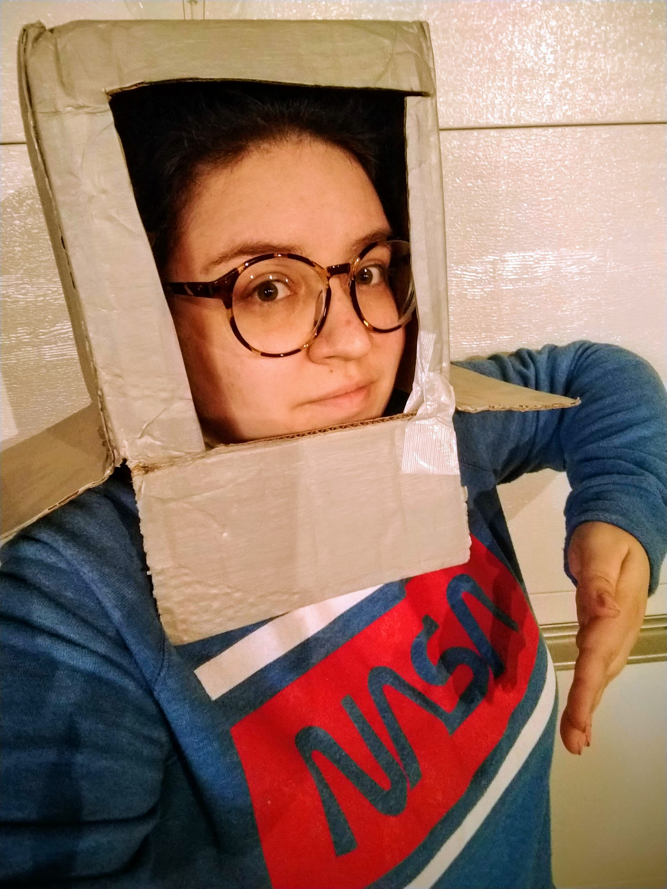

## Artwork by Naomi
I am a self-taught mixed media artist. I regularly work with recycled and repurposed materials as a means to improve my impact on the environment, save money, and transform materials that are commonly overlooked. In new materials, I work with watercolor, gouache, acrylic paints, and acrylic inks. Some of my favorite art tools are fixed and modified vintage toys like the [Twirl-o-Paint](https://www.industrialartifacts.net/products/vintage-twirl-o-paint-childrens-painting-turntable?variant=13256531771435) and [The Big Press](https://media.hibid.com/img.axd?id=4392046215&wid=&p=&ext=&w=0&h=0&t=&lp=&c=True&wt=False&sz=Max&rt=0&checksum=ZyLkULNan0e4jF917H84vMtV0qjFPo2A). In addition to different techniques for painting and the use of vintage art toys, I also like to create film and photo projects professionally and personally.

I hosted Paint Nights for the Purdue Graduate Student Government from February 2019 through November 2021. This event was routinely fully booked with a long waitlist as it had been incredibly popular. During COVID-19 we switched to an online format for a few of our events with positive feedback from participants. 

I also do [poetry](haiku)! I do not currently sell any of my art work nor do I take commission. 

### Taking Off My Eyeballs

_This multimedia art piece was created using acrylic paint on a pair of glasses that had an out of date presecription using a reverse painting technique._

This work was an opportunity for me to transform a pair of glasses that I had lingering around with me which did not have a use to me as the prescription was out-of-date. I took up learning reverse painting to practice thinking of my paintings in terms of layering like one might do in digital art. I had been dabbling a bit in digital art around the time I made these and thought to use the digital platform as a way to plan out each of the painted layers. It was fun to see how this painting influenced my practicing with digital art and how the digital tools served as assistive technology for me in this project. As a child I was always fascinated with tiny objects and beads were no exception to this so I made the glasses chain out of my collection of acquired and found beads that I've carried around with me for years. The final presentation of this project was a return to the digital art that I was practicing and using to assist me in creating these glasses. I was pleased that I was able to use technology to both recreate and remove eyes from this work.

### Stained (eye)Glass(es)
Glass2024.jpg)

_This multimedia art piece was created using [Gallery Glass paint](https://plaidonline.com/shop-products/gallery-glass-stained-glass-effect-paint-real-red-2-oz-19777) on a pair of glasses that had an out of date prescription. Spring 2024._

This project was a chance to return to the concept of _Taking Off My Eyeballs_ and infuse if with the aesthetic of stained glass. I did a lot of experimenting with this new paint. It was a bit of a learning curve to get the faux solder lines even. I like that I can also peel up the paint and restick it to a different surface. It could be neat to make something that is conceptually similar to color/patterned contact lenses, but for these glasses. I also have several pairs of old glasses and see them at thrift shops regulary which means I could do a more sculptural project. Maybe some day I'll make a full lamp shade of Stained (eye)Glass(es)!

### Twirl-o-Painting 45s

_This was my set up at Art in the Park, hosted by the Lafayette Parks Department, in the summer of 2020._

This is an example of my use of a piece of retro children’s art equipment for creating my own work. After 3D printing a custom attachment, the Twirl-o-Paint is able to hold 45rpm records and I’m able to cover the labels on the records during the painting process to preserve them. Sometimes I will draw color inspiration from the label itself or from the title of the song. All 45s used for this work were purchased in a large lot of damaged and no longer functional 45s from eBay at about $0.10 per 45, this is an inexpensive surface to work with and gives me flexibility to work with a variety of medium to high flow acrylic paints. For me, this is like the fun of tie-dye, but faster. One of my favorite parts about my time as a vendor for Art in the Park was all the young kids dragging older relatives over to my table to show them the cool colors and the Twirl-o-Paint which was then followed by the older relatives trying to explain to the children what a 45 record was. 

### Zoom wedding

_This multimedia art work was created over the course of several years. The final product was realized during the COVID-19 spring of 2021._

This work demonstrates a core concept that I taught as a Recreational Art Instructor; no canvas is truly wasted on "bad" art because we can simply paint over it until we like what we see. I began working with this specific canvas in 2019 and it has featured numerous art pieces that I have displayed in my own home, but those pieces never stayed for very long because they just did not feel quite right to me. It was in the fall of 2020 that I felt compelled to make my most drastic revision to this canvas yet by cutting slits onto it and embroidering new elements upon its surface. Over the months that I continued to build on this latest version the additions to the piece became more complicated and I was uncertain that, like the COVID-19 pandemic, this project would ever come to an end. Fortunately, and unlike the pandemic (as of December 2022), this project came to a place where it felt comfortably completed in the spring of 2021.

### Grad Student Window

_Acrylic on canvas board. Winter 2018._

My earliest full piece involving a window dates back to 2018 when I made a window for my (now) husband to hang up in his grad student office on campus. At the school we went to--and in the programs we were in--grad students didn't get crammed into offices with windows and this can be fairly grueling over the years. So, to alleviate the ennui my he was feeling, I painted him a window with a view of the Palouse hills at sunset. At the time when I made this I was still fairly new to acrylic painting and working through this really helped me develop as an artist. From this work, I learned that I have the patience to do technically challenging and detailed paintings.

### Spirit Houses in Eklutna, AK

_This watercolor sketch was created in the summer of 2021 on a trip I took to Alaska with my husband._

This work was created as a means to recapture a memory of a moment that I had photographed while visiting some of the Spirit Houses in Eklutna, Alaska. The colonialist and proselytizing push on the local peoples that forced a blending different burial traditions together fascinated me. As an outsider to both communities I felt odd taking in this site and humbled by the resilient-stubbornness of both communities to continue both of their practices rather than having one completely eclipse the other. I like to recapture small moments of my travel that I capture in photographs as it allows me to spend more time with that moment than I might have initially.

### Portrait

_Mixed media portrait on a recycled art print I found at a thrift store. Summer 2022._

Currently my ownly portrait I've ever painted. I took a sweet photo of my husband from a hike that we were on and decided to challenge myself to paint a portrait. I got through with the base painting for his bust and could not unsee the [Disaster Girl meme](https://en.wikipedia.org/wiki/Disaster_Girl). After a short hiatus from the painting I determined that I had to make the connection to the meme a reality and transformed my impressionist background of nature into a house on fire. After doing the under painting, I added detail with oil pastels and then finished it with a matte finishing spray. I loved this painting so much that I put it near my desk in (what was) my home office to make sure I always had a friendlyface to look at while I was on video conferencing calls. 

### Recycled Rodents

_Mixed media recycled art made from egg cartons and scrap paper. Spring 2024._

I saw the inspo online and decided I had to try it! They were meant to be rabbits, but the ears turned out a little small. They are now some kind of rodent. At the time I made this I was in a pretty bad rut and funk. Getting my hands messy with a cute project to distract from my career at that time was cathartic.

### Stamps

_Cut lino stamps and ink. Spring 2024._

For my birthday I treated myself to a trip to a BIG art store. I spent hours there looking at every supply to learn more about the kinds of tools and materials other artists use. By the end of that trip, I left with a small blank block of lino and a lino carving set. I remember cutting lino once in high school. One of my favorite art pieces in my home from another artist is a large lino print. So I thought I'd give it a shot. Then, for a little over a month, those art supplies sat on my art table while I stressed over what stamp to carve. What could be worthy of this precious supply? What could possibly be so important that I needed to be able to repeatedly stamp it over and over and over again? My favorite utterance to inject sarcasm into conversation and the Yiddish phrase that is tattooed on my arm & soul.

### Videos

[Technofeminism](https://youtu.be/VaXiNDdpK90) _is a video essay that I created for an independent study course I did in the summer of 2020. This was my first attempt at a video essay and I am most proud of the short sci-fi sketch my husband performed in to highlight what Technofeminism is not. This project is one of my earliest documentations of my intellectualizing of and musing about bathrooms which has come to playfully exasperate my friends and family over the years. I thought I'd also share a behind the scenes shot of my costume making for this project_

[Even the Toothbrush Was Digital](https://youtu.be/UEXgznoUKl4) _is the second video essay that I created and was for a course I took in the fall of 2020. The goal of this project was to explore my relationship to technology during my time working-from-home because of COVID-19 and reflecting on the intersectionality of technological and work experiences. The expereince of capturing and discussing the immense privilege and responsibility of being able to work-from-home during a pandemic has lingered for me in the time since. This continues to inform my work and organizing today._

[Rotary Number Pad Infomercial](https://youtu.be/16BeWr7bywQ) _is a fake advertisement I created for Alden Bradford's electronics project where he transformed a rotary phone into a number pad for computers. Is it a practical item? Will this be the next technological sensation? Does this feel a little adjacent to steampunk technologies? I'll let you decide._

[Remote Access and Accessibility: An Accessible Video](https://www.youtube.com/watch?v=oEXz5LoXmtM) _is a short pre-recorded presentation I was a co-producer on with Emily Krebs and Kristen Tollan for the 2022 National Communication Association (NCA) conference. This presentation highlights the utility of video presentations at NCA. In this video we demonstrate: 1) who benefits from this format, 2) what infrastructure is needed to support video engagement, and 3) what can be done to make video content accessible._

[temporality](https://youtu.be/XKHCBQPYtIU) _is a short visual gag I created while visiting the Eskenazi Museum of Art Museum in 2022._

[Ingredients](https://youtu.be/ln9bcgCSeic) _is a short visal gag I created with Alden Bradford one evening in 2019 over a cup of tea._

[day 5](https://youtu.be/GLV2eWA7BoQ) _is a stop motion project I did one afternoon in 2018._
